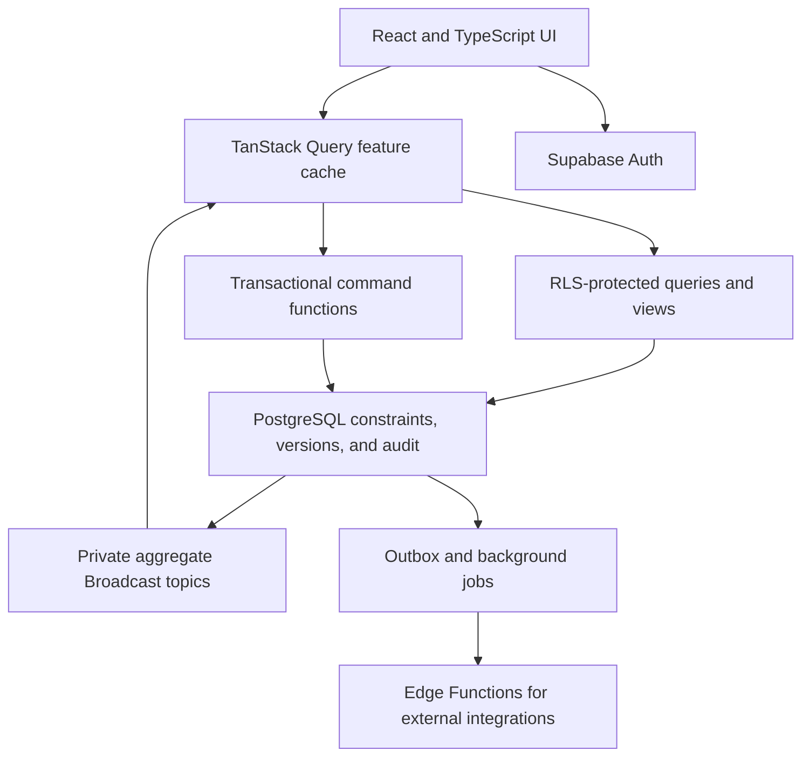
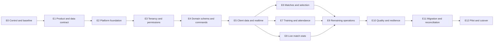

# Statto v2 complete rebuild — long-running task plan

Status: Draft for approval

Planning branch: `codex/statto-v2-rebuild-plan`

Baseline: `main` at `ddb8fc3` / Statto Web `0.6.20`

Created: 10 July 2026

Execution model: one persistent task, delivered through gated epics

## 1. How to use this plan

This document is the source of truth for a complete parallel rebuild of Statto. It is deliberately structured so one long-running coding task can execute the work without relying on conversation history.

The executing task must:

1. Read this document, `AGENTS.md`, and `README.md` before changing code.
2. Work through epics in dependency order.
3. Keep the Epic Status Board and Execution Log current.
4. Complete every epic gate before starting a dependent epic.
5. Record material design decisions in this document or a linked ADR.
6. Preserve the existing production app until the cutover epic is explicitly authorised.
7. Stop at any approval gate that requires production access, deployment, data migration, or irreversible action.

The plan is complete when every Definition of Done item in section 15 is evidenced, not merely when the new UI renders.

## 2. Objective

Build Statto v2 as a multi-club, multi-user football operations platform that supports concurrent coaching and player workflows, near-real-time updates, reliable offline recovery for match-day actions, and database-enforced data integrity.

The rebuild must retain the strongest existing product workflows:

- the weekly coach dashboard;
- training scheduling and attendance;
- match availability;
- Cup, Both, and Plate weekend selection;
- team positions, balance, and announcement output;
- live match statistics;
- votes, games played, fitness, player development, fines, and payments;
- club administration, invitations, roles, and squad scope;
- the existing Warners Bay Bulldogs visual identity as the first club theme.

The rebuild must remove the current dependency on browser-owned copies of whole-club state, client-only business constraints, broad direct table writes, and schema compatibility fallbacks.

## 3. Fixed architectural direction

These decisions are fixed unless an ADR demonstrates a material reason to change them.

### 3.1 Keep

- React, TypeScript, Vite, and React Router.
- PostgreSQL, Supabase Auth, Storage, Realtime, and Edge Functions.
- Vercel for the web application.
- The existing product language and core visual system.

### 3.2 Introduce

- TanStack Query for server-state queries, mutations, invalidation, and recovery.
- A parallel v2 application and Supabase project/environment.
- Timestamped database migrations and generated TypeScript database types.
- Transactional PostgreSQL command functions for material writes.
- Private, aggregate-scoped Supabase Broadcast topics.
- Row-level security tests for every role and operation.
- Immutable audit events, idempotency keys, and aggregate versions.
- Event-based match statistics with server-side projections.
- Repeatable migration and reconciliation tooling.

### 3.3 Do not introduce by default

- Next.js or another replacement web framework.
- A generic global state store for server data.
- Microservices.
- Kafka or an external event bus.
- CRDTs.
- GraphQL.
- A custom design-system framework.
- Direct browser access to a service-role key.
- Permanent dual writes between v1 and v2.

## 4. Scope boundaries

### 4.1 In scope

- New v2 frontend and backend schema.
- Multi-club tenancy and per-club membership.
- Admin, coach, player, and player-leader permissions.
- Data-driven seasons, teams, squads, and grade labels.
- Real-time collaboration and presence on high-value screens.
- Conflict detection and safe retries.
- Data migration from the current Statto schema.
- Production-readiness, observability, security, accessibility, and recovery.
- A pilot and controlled production cutover.

### 4.2 Out of scope unless separately approved

- Native iOS or Android apps.
- Public league-wide competition management.
- Payments processing or storing card data.
- Payroll, accounting, or banking integrations.
- General social networking or chat.
- AI-generated selection decisions.
- Replacing Supabase or Vercel.
- Rewriting historical v1 commits.

## 4A. What already exists and reuse policy

The rebuild must reuse proven product behaviour and pure domain logic where it remains correct. It must not copy the v1 synchronisation model into new folders.

| Existing asset | Reuse decision |
|---|---|
| Dashboard, training, match, player, and admin route journeys | Reuse the user intent and terminology; rebuild data access and mutation behaviour |
| Weekend Cup/Both/Plate selection cockpit | Reuse the information hierarchy, balance context, and both-game workflow; replace persistence with a versioned selection aggregate |
| Pure helpers in `lib/attendance.ts`, `lib/availability.ts`, `lib/games-played.ts`, `lib/match-lineup.ts`, `lib/match-stats.ts`, and `lib/team.ts` | Port only after characterisation tests prove current behaviour and the new domain model still needs it |
| Existing blue/white visual system and Bulldogs theme | Reuse as the first theme through v2 UI tokens and primitives |
| Supabase Auth, club memberships, role concepts, and RLS helper intent | Reuse concepts; rebuild policies from a deny-by-default tested matrix |
| Existing Realtime subscriptions | Do not reuse implementation; replace club-wide Postgres Changes with scoped private Broadcast topics |
| Existing `club-data-context.tsx` and local whole-club snapshots | Do not port |
| Existing `supabase/schema.sql` | Use only as migration input and behavioural evidence; do not make it the v2 schema source of truth |
| Existing storage compatibility fallbacks | Do not port; environments must migrate before code that requires the schema is released |

Before porting any helper, write a characterisation test covering its accepted current behaviour and explicitly identify behaviour that v2 intentionally changes.

## 5. Long-running task operating contract

### 5.1 Autonomy

The task may, without further confirmation:

- create and edit files on its assigned implementation branch;
- add narrowly justified dependencies named in this plan;
- create local migrations, seed data, tests, and development scripts;
- run local databases, builds, type checks, tests, linters, and browser QA;
- create local commits at epic boundaries when validation passes;
- continue to independent work when a non-critical subtask is temporarily blocked.

The task must obtain explicit approval before it:

- links to or changes a production Supabase project;
- runs a migration against production or a shared live environment;
- reads production data beyond an approved export or diagnostic query;
- pushes a branch, opens or merges a pull request, or deploys;
- changes DNS, Vercel production aliases, Auth URLs, secrets, or access policies;
- sends email, invitations, reminders, or other external messages;
- deletes production data or removes the v1 application.

### 5.2 Progress discipline

- At most one epic may be `IN PROGRESS`.
- Every epic must end with validation evidence and an updated status board.
- Create a small commit after an epic or independently reviewable vertical slice passes its gate.
- Do not mix v1 feature work into the v2 rebuild commits.
- If context is compacted, resume from the Status Board, Decision Register, and Execution Log.
- If the task is blocked, record the exact blocker and continue only where dependency order remains valid.

### 5.3 Definition of blocked

A task is genuinely blocked when it cannot proceed without one of:

- a product decision that changes stored data or user-visible behaviour;
- unavailable credentials or an unavailable external environment;
- approval for an external or irreversible action;
- missing production data needed to validate a migration mapping;
- repeated failure of the same required local dependency after reasonable recovery attempts.

Do not treat a failing test, complex implementation, or an incomplete epic as an approval blocker.

## 6. Non-negotiable guardrails

### G01 — Parallel build

Keep v1 operational and unchanged except for an explicitly approved export adapter, compatibility view, or cutover notice. Build v2 in isolated directories and environments.

### G02 — Production safety

No production deployment, live schema change, live data mutation, secret change, or external message is authorised by this plan alone.

### G03 — Database is authoritative

The browser may provide optimistic feedback, but only a committed server response is authoritative. The UI must never claim `Saved` merely because local state changed.

### G04 — Transactional commands

All writes that enforce business rules or affect multiple rows must use a transactional PostgreSQL command function. Prefer `SECURITY INVOKER`; use `SECURITY DEFINER` only with explicit permission checks, a locked search path, minimal grants, and tests.

### G05 — Idempotency

Every retryable material command carries a UUID `command_id`. The database stores command results or enforces uniqueness so a timeout and retry cannot duplicate an action.

### G06 — Concurrency

Mutable aggregates use an integer `version`. Commands that replace or reorder an aggregate submit `expected_version`. A mismatch returns a typed conflict and the current canonical version.

### G07 — Integrity in PostgreSQL

Foreign keys, unique constraints, checks, exclusion rules, and transactional functions enforce invariants. UI validation is convenience, not protection.

### G08 — Tenant isolation

Every tenant-owned row carries `club_id`. Cross-table relationships use keys that prevent linking records across clubs. Every exposed table and private realtime topic is covered by RLS.

### G09 — Least privilege

The UI may hide unavailable actions, but database policy is the security boundary. Player identity is bound to a membership on the server. Admin `view as player` is an explicit preview mode and never changes the authenticated identity.

### G10 — Real-time propagation, not correctness

Realtime events notify clients of committed changes. Clients invalidate and refetch the smallest affected query. A reconnect always reconciles with canonical database state.

### G11 — Scoped subscriptions

Do not subscribe every client to every club table. Use private topics scoped to the active aggregate, such as `club:{clubId}:fixture:{fixtureId}`.

### G12 — No whole-club browser snapshot

Do not persist complete club datasets in `localStorage`. Cache only the data required for active screens. Any offline store must be encrypted or appropriately bounded, versioned, expiring, and documented.

### G13 — Offline queue is narrow

Offline command queuing is limited initially to attendance and live match-stat events. Team selection replacement, permission changes, invitations, finance changes, and policy changes require an online server acknowledgement.

### G14 — Schema migrations only

Every schema change is a timestamped migration. No runtime fallback may silently omit a column or save a reduced record because an environment is behind.

### G15 — Generated contracts

Generate TypeScript types from the database in CI. Hand-written domain types may wrap generated types but may not contradict them.

### G16 — Data-driven club structure

Do not hardcode Cup and Plate into storage or permission models. Teams, grade labels, limits, and season participation are stored data. The first club may configure the familiar labels.

### G17 — Immutable history where it matters

Live stats, payments, audit records, and command receipts are append-only. Corrections are reversal or superseding events, not destructive history edits.

### G18 — Explicit save state

Every mutation surface exposes `Saving`, `Saved`, `Offline`, `Retrying`, `Conflict`, or `Failed`. Failed commands retain recoverable user intent without misrepresenting server state.

### G19 — Mobile task first

At phone breakpoints, the active workflow appears before secondary admin navigation. Attendance, availability, selection, and live stats must be usable one-handed.

### G20 — Accessibility

All actions have keyboard and screen-reader semantics, visible focus, non-colour status indicators, and WCAG 2.2 AA contrast targets.

### G21 — Tests before migration

No migration or cutover rehearsal proceeds while domain, RLS, concurrency, or migration-reconciliation tests are red.

### G22 — Evidence before completion

An epic is complete only when its acceptance criteria have corresponding test, command, screenshot, or reconciliation evidence recorded in the Execution Log.

### G23 — Bounded reads and measurable performance

Every list query is filtered, indexed, and paginated or demonstrably bounded. Avoid N+1 reads and unbounded club-history loads. Performance budgets in section 9.5 are release gates, not optional optimisation work.

## 7. Target architecture



### 7.1 Proposed repository layout

```text
apps/
  web-v2/                 # New React application
packages/
  domain/                 # Pure domain calculations and shared contracts
  ui/                     # Reusable Statto visual primitives
supabase-v2/
  config.toml
  migrations/             # Ordered source of truth
  functions/              # External integration functions only
  seed.sql
  tests/                  # pgTAP and RLS tests
tools/
  migration/              # Export, transform, import, reconcile
docs/
  rebuild/                # Plan, ADRs, runbooks, evidence
web/                      # Existing production application; preserve until cutover
supabase/                 # Existing production schema assets; preserve until approved
```

### 7.2 Frontend boundaries

Each feature owns:

- query-key factories;
- typed read functions;
- command functions;
- realtime invalidation hooks;
- route-level screens;
- components and domain-focused tests.

Suggested feature boundaries:

- `clubs`
- `memberships`
- `people`
- `seasons`
- `teams`
- `training`
- `fixtures`
- `availability`
- `selections`
- `match-stats`
- `votes`
- `fitness`
- `development`
- `fines`
- `admin`

There must be no replacement for the v1 whole-club context.

### 7.3 Authoritative command flow

```text
USER ACTION
    |
    v
Validate input locally
    |
    v
Create command_id + expected_version
    |
    v
Show SAVING/OFFLINE state
    |
    v
Transactional PostgreSQL command
    |-- authenticate and authorise
    |-- deduplicate command_id
    |-- lock/version-check aggregate
    |-- validate invariants
    |-- write domain rows + audit/outbox
    '-- commit canonical version
    |
    +--> success --------> update exact query cache --> show SAVED
    |
    +--> version conflict -> refetch canonical state -> show CONFLICT
    |
    '--> transient failure -> retain recoverable intent -> RETRY/FAILED

COMMITTED CHANGE
    |
    v
Private aggregate Broadcast
    |
    v
Other clients invalidate exact query key and refetch canonical state
```

### 7.4 Mutation-state contract

```text
IDLE
  |
  +-- online submit --> SAVING --ack--> SAVED --> IDLE
  |                         |--conflict--> CONFLICT --refresh/resubmit--> SAVING
  |                         '--failure---> FAILED --retry--> SAVING
  |
  '-- offline allowed --> OFFLINE_QUEUED --reconnect--> SAVING

Rules:
- only server acknowledgement enters SAVED;
- only attendance and stat events may enter OFFLINE_QUEUED initially;
- navigation must not silently discard OFFLINE_QUEUED, CONFLICT, or FAILED intent.
```

## 8. Domain model and invariants

| Aggregate | Primary records | Required invariants |
|---|---|---|
| Club identity | `clubs`, `memberships`, `profiles` | One membership per club/user; server-owned role and player link |
| Season structure | `seasons`, `teams`, `team_memberships` | Team belongs to one club and season; player participation is explicit |
| Players | `people`, `player_registrations` | A person can participate across seasons without duplicating identity |
| Training | `training_sessions`, `attendance_responses` | One response per session/player; valid status; actor and source recorded |
| Fixtures | `fixtures`, `opponents`, `venues` | Fixture belongs to one team and season; typed start time and status |
| Availability | `availability_responses` | One response per fixture/player; player or authorised coach only |
| Selection | `team_selections`, `selection_members` | Draft/final state; max players enforced transactionally; one row per player |
| Match stats | `match_stat_events`, projections | Append-only events; unique command ID; reversals retain history |
| Votes | `ballots`, `ballot_entries` | Eligible voter and nominee; one ballot per fixture/voter/type |
| Fitness | `fitness_assessments`, `fitness_results` | Metric definitions are typed; measurements retain recorded time and actor |
| Development | `development_plans`, `development_updates` | Private scope; chronological progress history |
| Finance | `fines`, `fine_payments` | Amounts are positive; payment history replaces mutable paid flag |
| Operations | `audit_events`, `command_receipts`, `outbox_events` | Immutable actor/action/target/time and deduplicated commands |

Every mutable aggregate record must include:

- `id uuid`;
- `club_id uuid`;
- `version integer not null default 1` where aggregate replacement can conflict;
- `created_at timestamptz`;
- `created_by uuid`;
- `updated_at timestamptz`;
- `updated_by uuid`.

## 9. Shared command and realtime contracts

### 9.1 Command envelope

```ts
type CommandEnvelope<T> = {
  commandId: string;
  clubId: string;
  expectedVersion?: number;
  payload: T;
};
```

Successful commands return the canonical aggregate identifier, current version, updated timestamp, and affected query keys or event type.

Typed failures must distinguish:

- unauthenticated;
- forbidden;
- validation failed;
- not found;
- version conflict;
- invariant conflict;
- idempotent replay;
- transient service failure.

### 9.2 Realtime contract

A committed change broadcasts a small envelope rather than a whole club snapshot:

```ts
type AggregateChanged = {
  clubId: string;
  aggregateType: string;
  aggregateId: string;
  version?: number;
  changedAt: string;
  actorId?: string;
};
```

Clients use the event to invalidate an exact query key. They do not assume the event payload is a complete or authoritative record.

### 9.3 Presence contract

Presence is advisory and limited to collaborative screens:

- weekend selection;
- fixture selection detail;
- live stats capture;
- training attendance.

Presence may show who is active but never acts as a hard lock. Database commands remain the arbiter.

### 9.4 Concurrency policy by aggregate

| Aggregate | Write strategy | Conflict behaviour |
|---|---|---|
| Memberships and policy settings | Versioned command | Reject stale version and require review |
| Availability response | Versioned row command | Reject stale edit; return current response, actor, and time |
| Attendance response | Versioned row command; offline command ID allowed | Deduplicate replay; surface conflicting newer response |
| Team selection | Locked, versioned aggregate replacement | Reject stale draft; never merge silently |
| Match stats | Append-only idempotent event | Concurrent valid events both commit; corrections reverse a specific event |
| Votes | Transactional ballot submission | Reject duplicate or newly ineligible ballot |
| Fine and payment records | Append-only finance commands where applicable | Duplicate command is replayed; correction is a reversal/superseding record |

### 9.5 Initial scale and performance envelope

E0 and E1 must confirm or revise these targets before implementation depends on them. Until revised, they are the acceptance envelope:

- up to 250 clubs;
- up to 250 active members per club;
- up to 50 simultaneously connected users in one club;
- up to 10 users viewing or editing one collaborative aggregate;
- two or more concurrent scorers for one fixture;
- mutation acknowledgement p95 under 1.5 seconds in the primary operating region;
- committed-change propagation to another active client p95 under 2 seconds;
- core mobile route LCP p75 under 2.5 seconds on a representative 4G profile;
- no initial route query returns unrelated full-season or full-club collections;
- list queries default to a maximum page size of 50 unless a documented bounded dataset justifies more.

Load tests must exercise RLS and the real command path. A fast unauthorised or mock-only benchmark is not acceptance evidence.

## 10. Epic map and dependency order



## 11. Epic Status Board

Allowed statuses: `NOT STARTED`, `IN PROGRESS`, `BLOCKED`, `COMPLETE`.

| Epic | Status | Evidence / blocker |
|---|---|---|
| E0 Control and baseline | NOT STARTED | |
| E1 Product and data contract | NOT STARTED | |
| E2 Platform foundation | NOT STARTED | |
| E3 Tenancy and permissions | NOT STARTED | |
| E4 Domain schema and commands | NOT STARTED | |
| E5 Client data and realtime | NOT STARTED | |
| E6 Matches, availability, and selection | NOT STARTED | |
| E7 Training and attendance | NOT STARTED | |
| E8 Live match statistics | NOT STARTED | |
| E9 Remaining club operations | NOT STARTED | |
| E10 Quality, security, and resilience | NOT STARTED | |
| E11 Migration and reconciliation | NOT STARTED | |
| E12 Pilot and production cutover | NOT STARTED | Approval required |

## 12. Epic specifications

### E0 — Execution control and verified baseline

Objective: establish a reproducible starting point and prevent the long-running task from losing scope.

Deliverables:

- Confirm the implementation branch and clean baseline.
- Record current production version, current source commit, and environment inventory.
- Catalogue current routes and user workflows.
- Capture representative desktop and mobile screenshots without mutating data.
- Record v1 table and row counts from an approved non-production snapshot or export.
- Create the Decision Register and begin the Execution Log.
- Add a local validation command that runs all available v2 checks as they are introduced.

Acceptance criteria:

- Baseline can be reproduced by another developer.
- Every v1 feature is mapped to a target epic or explicitly excluded.
- No production write is performed.
- Status Board marks only E0 complete.

### E1 — Product contract and canonical data mapping

Objective: translate the current application into explicit business rules and migration mappings before schema implementation.

Deliverables:

- Role and permission matrix for admin, coach, player leader, and player.
- User journeys for dashboard, attendance, availability, selection, stats, votes, and fines.
- Canonical terminology for club, season, team, person, player registration, fixture, response, and selection.
- v1-to-v2 data mapping for every existing table and meaningful column.
- Decisions on historical seasons, inactive players, duplicate identities, unknown values, and legacy response timestamps.
- Acceptance scenarios for multi-user conflicts.

Acceptance criteria:

- No v2 table has unresolved ownership or tenancy semantics.
- Cup and Plate are configured team labels, not schema enums.
- Availability and selection have independent lifecycles.
- Product decisions affecting migration are recorded in the Decision Register.

### E2 — Platform foundation

Objective: create an isolated, reproducible v2 development platform.

Deliverables:

- `apps/web-v2`, `packages/domain`, `packages/ui`, and `supabase-v2` scaffolding.
- Local Supabase start/reset workflow.
- Separate development, test, staging, and production configuration contracts.
- Publishable client-key configuration; no service role in browser variables.
- TanStack Query, router, generated types, and error-boundary setup.
- Vitest, React Testing Library, Playwright, and pgTAP foundations.
- CI checks for formatting, typecheck, unit tests, database reset, migrations, generated-type drift, RLS tests, and build.
- Dependency and secret scanning.

Acceptance criteria:

- A clean clone can install, reset the v2 database, seed it, test it, and run the app from documented commands.
- CI fails on schema/type drift.
- No v2 command references the current production Supabase project.

### E3 — Multi-club tenancy, identity, and permissions

Objective: make identity and authorisation correct before feature delivery.

Deliverables:

- Clubs, profiles, memberships, seasons, teams, people, player registrations, and team memberships.
- Invitation lifecycle with expiring, single-use tokens or approved Supabase invitation pattern.
- Server-bound player identity.
- Role and team scope helper functions.
- RLS for every identity and structure table.
- Admin-only membership management commands.
- Read-only admin player-preview mode.
- RLS test matrix covering allowed and denied operations.

Acceptance criteria:

- One user can belong to multiple clubs with different roles.
- A player cannot choose or mutate another player identity.
- A coach is restricted to authorised teams.
- Cross-club references and reads fail at the database boundary.
- All denied access tests return no sensitive row data.

### E4 — Domain schema, integrity, and command layer

Objective: establish the database primitives used by all features.

Deliverables:

- Ordered migrations for the domain model in section 8.
- Composite tenant-safe foreign keys and indexes.
- Enum/check strategy for stable statuses while leaving club labels data-driven.
- Audit events, command receipts, and outbox events.
- Reusable permission and command helpers.
- Version-conflict response contract.
- Command-level unit and concurrency tests.
- Backup and restore validation for a local test database.
- 100% statement and branch coverage for domain invariants, permission helpers, and command functions, with mutation or equivalent strength checks for the highest-risk rules.

Acceptance criteria:

- Invalid cross-club, orphaned, duplicate, and out-of-range records cannot be written directly.
- Replaying a command ID produces the original result or a typed replay response.
- Concurrent versioned commands cannot silently overwrite each other.
- A fresh database is created entirely from migrations.

### E5 — Client data access, mutations, and realtime

Objective: prove the new frontend state model before feature expansion.

Deliverables:

- Feature query-key factories.
- Central Supabase client and typed error mapping.
- Query-scoped repositories and command hooks.
- Mutation state components for saving, saved, offline, retry, conflict, and failure.
- Private Broadcast trigger/topic convention and authorization.
- Query invalidation from aggregate events.
- Reconnect reconciliation and stale-cache tests.
- Presence primitives for collaborative screens.

Acceptance criteria:

- No whole-club server-state provider exists.
- A realtime event refetches only affected queries.
- Disconnect/reconnect converges to canonical server state.
- A failed mutation never leaves the UI labelled as saved.

### E6 — Matches, availability, and weekend selection

Objective: deliver the highest-risk collaborative vertical slice first.

Deliverables:

- Fixture list and detail.
- Player availability response flow.
- Coach availability correction with source and actor history.
- Data-driven weekend grouping.
- Cup, Both, and Plate-style selection cockpit using configured teams.
- Draft and final selection states.
- Team balance, position context, game-load context, and both-team selection.
- Transactional selection command with maximum-team-size enforcement.
- Selection revisions, conflicts, realtime updates, and presence.
- Team announcement read model and image/export workflow.

Acceptance criteria:

- Two coaches attempting the final available slot simultaneously result in exactly one accepted command.
- A stale selection replacement returns a visible conflict with canonical state.
- A player can only update permitted availability.
- Availability remains intact when a player is added to or removed from selection.
- Team-size limits are enforced in PostgreSQL.
- Mobile selection reaches the working board before secondary navigation.

### E7 — Training sessions and attendance

Objective: rebuild training planning and one-handed attendance capture.

Deliverables:

- Training list, session detail, plan attachment, focus, and run-plan data.
- Session creation and generation rules.
- Attendance responses with actor, source, and timestamp.
- Coach correction history.
- Query-scoped realtime updates and presence.
- Narrow offline command queue with idempotent replay.
- Accessible number/name sorting and completion summaries.

Acceptance criteria:

- Concurrent attendance edits converge to the accepted canonical record and retain actor history.
- Replayed offline commands do not duplicate records.
- The UI distinguishes pending offline work from saved attendance.
- Session/player foreign keys prevent orphaned attendance.

### E8 — Event-based live match statistics

Objective: eliminate lost updates while supporting multiple match-day scorers.

Deliverables:

- Append-only stat event model.
- Idempotent `record`, `correct`, and `reverse` commands.
- Server-side score/stat projections.
- Quarter lifecycle and fixture status rules.
- Live score strip, capture controls, report view, recent activity, and server-backed undo.
- Realtime fixture topic and scorer presence.
- Offline event queue with ordered, idempotent replay.

Acceptance criteria:

- Two simultaneous increments to the same metric both count.
- Undo reverses a specific committed event, not the current displayed total.
- Reconnecting clients rebuild reports from canonical projections.
- Corrections preserve the original event and actor.

### E9 — Remaining club operations

Objective: complete feature parity without weakening earlier boundaries.

Deliverables:

- Player management and CSV import with preview and validation.
- Games-played reporting.
- Rotation groups and player profiles.
- Votes and ballot eligibility.
- Fitness assessments and results.
- Player development plans and progress history.
- Fines and payment ledger.
- Club policy settings.
- Reminder and calendar integrations through outbox-backed Edge Functions.
- Dashboards and attention queues built from scoped read models.

Acceptance criteria:

- Each module has explicit RLS, domain, integration, and browser tests.
- Import is previewable, idempotent, and reports row-level errors.
- Player votes cannot be read or submitted outside eligibility rules.
- Fine payment state is derived from ledger rows.
- External jobs are retryable and cannot send duplicates.

### E10 — Quality, security, accessibility, and resilience

Objective: prove the complete application is operationally safe.

Deliverables:

- Full RLS matrix and attempted cross-tenant access tests.
- Concurrency and idempotency test suite.
- Mobile and desktop browser test matrix.
- WCAG 2.2 AA audit and remediation.
- Error reporting, structured logs, correlation IDs, and command IDs.
- Realtime connection, lag, mutation-failure, and background-job metrics.
- Performance budgets and representative-load tests.
- Dependency, secret, and database linting.
- Backup/restore, incident, and degraded-mode runbooks.
- Coverage gates: 100% statement and branch coverage for domain/command packages; all critical UI branches and error states covered by component or end-to-end tests.

Acceptance criteria:

- No critical or high-severity security finding remains open.
- All RLS, concurrency, migration, and critical-path browser tests pass.
- Performance budgets are met with representative club and season data.
- Operational dashboards distinguish client, command, database, realtime, and integration failures.

### E11 — Data migration and reconciliation

Objective: make migration repeatable, observable, and reversible.

Deliverables:

- Approved v1 export method.
- Immutable source snapshot and manifest.
- Transform scripts with deterministic ID mapping.
- Validation rules for dates, players, squads, responses, selections, stats, votes, and fines.
- At least two full migration rehearsals against isolated environments.
- Reconciliation reports by club, season, team, fixture, session, player, and financial total.
- Delta migration procedure and rollback criteria.
- Data-quality exception register with explicit disposition.

Acceptance criteria:

- Re-running the migration against a clean database produces the same reconciled result.
- Counts and critical totals match approved tolerances.
- No migration script writes to v1.
- Every exception is resolved, accepted, or excluded by an identified decision owner.

### E12 — Pilot and controlled production cutover

Objective: move users to v2 without losing data or removing the rollback path.

Approval gate: this epic may not begin production actions without explicit user approval.

Deliverables:

- Staging user acceptance with named admin, coach, and player scenarios.
- Pilot with one authorised team or bounded user group.
- Production readiness review and go/no-go checklist.
- Short v1 write-freeze procedure.
- Final delta migration and reconciliation.
- Auth URL, Vercel alias, secret, and DNS change plan.
- v1 read-only mode and rollback window.
- Post-cutover monitoring and support plan.

Acceptance criteria:

- Approved users complete all critical workflows in staging and pilot.
- Final reconciliation passes before traffic moves.
- Rollback has an owner, trigger thresholds, and a tested procedure.
- v1 remains read-only for at least 30 days or the approved retention period.
- No permanent dual-write path remains.

## 13. Validation matrix

| Layer | Required evidence |
|---|---|
| Domain | Unit tests for calculations, limits, status transitions, and eligibility |
| Database | Fresh reset, migrations, constraints, command tests, pgTAP |
| Authorization | Positive and negative RLS matrix for every role and table/function |
| Concurrency | Parallel command tests for selection, attendance, stats, and idempotency |
| Frontend | Typecheck, unit/component tests, mutation-state tests |
| Realtime | Two-client propagation, reconnect reconciliation, private-topic denial |
| Offline | Queue replay, duplicate suppression, ordering, conflict presentation |
| Browser | Critical journeys on desktop and phone breakpoints |
| Accessibility | Automated scan plus keyboard and screen-reader-oriented manual checks |
| Migration | Repeatability, counts, totals, referential checks, exception report |
| Operations | Logs, metrics, error capture, backup/restore, degraded-mode runbook |

### 13.1 Planned code-path and user-flow coverage

```text
COMMAND PATHS
=============
[ ] authenticated + authorised + valid + current version --> commit and acknowledge
[ ] unauthenticated -------------------------------------> typed sign-in failure
[ ] authenticated but forbidden -------------------------> no row disclosure
[ ] invalid payload/invariant ---------------------------> field/domain error
[ ] duplicate command_id --------------------------------> safe replay result
[ ] stale expected_version ------------------------------> canonical conflict result
[ ] transaction timeout before response -----------------> retry without duplicate
[ ] committed command but missed Broadcast --------------> reconnect/refetch recovery

CRITICAL USER FLOWS
===================
[ ] [E2E] invite --> sign in --> club membership --> role-correct landing page
[ ] [E2E] player availability --> coach sees update --> coach corrects with history
[ ] [E2E] two coaches select final slot concurrently --> one accepted, one conflict
[ ] [E2E] two scorers record same metric concurrently --> both events counted
[ ] [E2E] attendance offline --> reconnect --> idempotent acknowledgement
[ ] [E2E] finalise team --> announcement and votes use same canonical selection
[ ] [E2E] migrate fixture/player history --> reconciliation report passes
[ ] [E2E] expired session during mutation --> recoverable sign-in and intent handling

BOUNDARIES AND ERROR UX
=======================
[ ] zero players, sessions, fixtures, votes, fines, and fitness results
[ ] maximum team size and attempt beyond maximum
[ ] duplicate names, numbers, emails, and legacy identifiers
[ ] slow command, realtime disconnect, browser refresh, and navigation mid-save
[ ] 50 concurrent users, long season history, and paginated list boundaries
[ ] keyboard-only and screen-reader completion of critical workflows
```

### 13.2 Production failure-mode review

| Path | Realistic failure | Required test | Required handling | User-visible result |
|---|---|---|---|---|
| Command submission | Response times out after commit | Idempotent retry integration test | Replay stored command result | Retrying, then Saved; no duplicate |
| Versioned selection | Two coaches save different drafts | Parallel transaction test | Reject stale expected version | Conflict with refresh/review action |
| Availability | Player and coach edit stale copies | Two-client version test | Return canonical response and actor | Clear conflict, no silent overwrite |
| Offline attendance | Queue replays twice | Offline replay test | Unique command receipt | One accepted response |
| Live stats | Two scorers tap simultaneously | Parallel event test | Append both events atomically | Both clients converge to correct total |
| Broadcast | Client misses or receives duplicate event | Reconnect and duplicate-event tests | Idempotent invalidation and refetch | Brief reconnect state, canonical recovery |
| RLS helper | Policy recursion or missing scope index | pgTAP and query-plan checks | Deny by default; indexed helper | Access denied or bounded error, never leaked rows |
| Migration | Legacy record references missing player | Rehearsal exception test | Quarantine with deterministic reason | Reconciliation blocks cutover |
| External reminder | Worker retries after send | Outbox idempotency test | Provider/delivery id stored | No duplicate reminder |
| Auth expiry | Token expires during save | Browser journey test | Refresh session or preserve intent | Sign-in/retry message; no false Saved |

No row in this table may remain without both a test and explicit handling before E10 completes.

### 13.3 Inline diagrams required during implementation

Keep small ASCII diagrams beside non-obvious implementation code in:

- the team-selection command and its version/lock transaction;
- the match-stat event/reversal projection pipeline;
- the offline command queue and replay state machine;
- the migration transform/reconciliation pipeline;
- RLS helper functions when role and team scope combine;
- end-to-end concurrency tests whose actor setup is otherwise difficult to understand.

Update or remove a diagram in the same change that makes it stale.

## 14. Risk register

| Risk | Early signal | Mitigation | Stop condition |
|---|---|---|---|
| Live schema differs from repository | Export fields or policies do not match | Pull an approved schema snapshot; update mapping, not production | Mapping cannot be proven |
| Player identities are ambiguous | Duplicate names/emails or missing membership links | Deterministic mapping plus exception register | Identity affects permissions and has no owner decision |
| Availability history is unreliable | Response timestamps predate relevant fixture workflow | Preserve raw value, classify provenance, agree migration rule | Current state cannot be distinguished safely |
| Selection concurrency leaks | Team exceeds configured maximum in stress test | Lock/version aggregate and enforce transactionally | Database test still permits overflow |
| Realtime becomes chatty | Whole-club invalidation or rising message counts | Aggregate topics and exact query invalidation | Design still requires club-wide subscription |
| Offline replay corrupts order | Duplicate or out-of-order stats | Command IDs, sequence metadata, server acknowledgements | Replay is not deterministic |
| RLS policy recursion or gaps | Unexpected empty reads or cross-tenant access | Indexed helper functions and pgTAP matrix | Any cross-tenant test succeeds |
| Scope expands during parity work | New modules bypass shared contracts | Epic gate review and ADR requirement | Proposed feature changes core architecture or migration |
| Cutover lacks rollback | Final delta or auth switch cannot be reversed | Read-only v1, immutable snapshot, tested restore | No tested rollback before go-live |

## 15. Complete rebuild Definition of Done

The long-running task is complete only when all of the following are true:

- [ ] All epics E0–E12 are `COMPLETE`.
- [ ] Every v1 production workflow is present in v2 or explicitly accepted as excluded.
- [ ] Multi-club tenancy and role scope are enforced by tested RLS.
- [ ] Availability and selection are independent aggregates.
- [ ] Team-size limits and selection versions are enforced transactionally.
- [ ] Live statistics use idempotent append-only events with server projections.
- [ ] No material browser mutation depends on direct unguarded table upserts.
- [ ] Realtime uses private scoped topics and targeted query invalidation.
- [ ] Offline attendance and stats queues replay deterministically without duplicates.
- [ ] The database is reproducible from migrations and seed data.
- [ ] Generated database types are current and checked in CI.
- [ ] Audit history identifies actor, time, action, and target for material changes.
- [ ] Critical workflows pass desktop, mobile, accessibility, and two-client tests.
- [ ] Two migration rehearsals and the final reconciliation pass.
- [ ] Production cutover and rollback are explicitly approved and executed successfully.
- [ ] v1 is preserved read-only for the agreed rollback window.
- [ ] Post-cutover monitoring shows no unresolved severity-one or severity-two failure.
- [ ] Final documentation covers setup, architecture, operations, migration, and recovery.

## 16. Decision Register

Record decisions that materially change stored data, security, workflow behaviour, migration, or operations.

| ID | Date | Decision | Reason | Consequence | Owner |
|---|---|---|---|---|---|
| D001 | 2026-07-10 | Build v2 in parallel and retain React, Supabase, and Vercel | Current risks are in state ownership and integrity, not the hosting stack | Lower migration risk; v1 remains available | Andrew |
| D002 | 2026-07-10 | Use transactional commands plus scoped Broadcast | Correctness must be server-owned; realtime is propagation | More explicit command and event contracts | Andrew |
| D003 | 2026-07-10 | Separate availability from team selection | They have different owners, lifecycles, and invariants | Requires explicit v1-to-v2 mapping | Andrew |
| D004 | 2026-07-10 | Use append-only stat events | Prevent lost concurrent increments and preserve corrections | Requires server projection and event replay | Andrew |

## 17. Execution Log

Append concise checkpoints. Do not paste raw sensitive data, full logs, or secrets.

| Date/time | Epic | Change | Validation | Next action / blocker |
|---|---|---|---|---|
| 2026-07-10 | Planning | Created complete rebuild execution plan | Plan review pending | Approve plan and start E0 |

## 18. Single-task execution directive

Use the following directive when starting the implementation task:

> Execute the Statto v2 rebuild from `docs/rebuild/statto-v2-long-running-task-plan.md` as one persistent task. Treat that file, `AGENTS.md`, and `README.md` as the source of truth. Work through one epic at a time in dependency order, keep the Epic Status Board, Decision Register, and Execution Log current, and complete every acceptance gate before starting a dependent epic. Preserve v1 and all production systems. You may edit, test, and commit locally on the assigned branch, but do not push, deploy, link or mutate production services, send external messages, or begin E12 production actions without explicit approval. Enforce business rules and permissions in PostgreSQL, use scoped realtime only for committed-change propagation, and provide evidence for every completed epic. If blocked, record the blocker and continue only with independent work that does not violate dependencies or guardrails. Do not declare completion until every Definition of Done item is evidenced.

## 19. Recommended execution sizing

Indicative elapsed time, subject to E0 and E1 findings:

- Two engineers plus part-time product/design/QA: 10–14 weeks.
- One engineer in a persistent task: 16–20 weeks.
- E0–E5 architecture proof: approximately 3–5 weeks.
- E6 matches/selection vertical slice: approximately 2–3 weeks.
- E7–E10 parity and hardening: approximately 4–6 weeks.
- E11–E12 migration, pilot, and cutover: approximately 2–3 weeks plus approval time.

The task should optimise for a safe, reviewable series of vertical slices, not for one enormous final commit.

## GSTACK REVIEW REPORT

| Review | Trigger | Why | Runs | Status | Findings |
|---|---|---|---|---|---|
| CEO Review | `/plan-ceo-review` | Scope and strategy | 0 | — | Optional before implementation |
| Codex Review | `/codex review` | Independent second opinion | 0 | — | — |
| Eng Review | `/plan-eng-review` | Architecture and tests (required) | 1 | CLEAR | 6 issues resolved, 0 critical gaps |
| Design Review | `/plan-design-review` | UI and UX gaps | 0 | — | Recommended before E6 UI implementation |

**ENG REVIEW:** Scope retained because the user explicitly requested the complete rebuild, but execution is constrained to gated vertical slices. The review added an explicit reuse policy, simplified the player identity model, locked concurrency policies by aggregate, defined performance budgets, added failure-mode and coverage plans, and added authoritative ASCII data-flow/state diagrams.

**UNRESOLVED:** 0 engineering decisions required before E0. Production environment, migration, and cutover approvals remain intentional execution gates.

**VERDICT:** ENG CLEARED — ready to begin E0 after plan approval.
